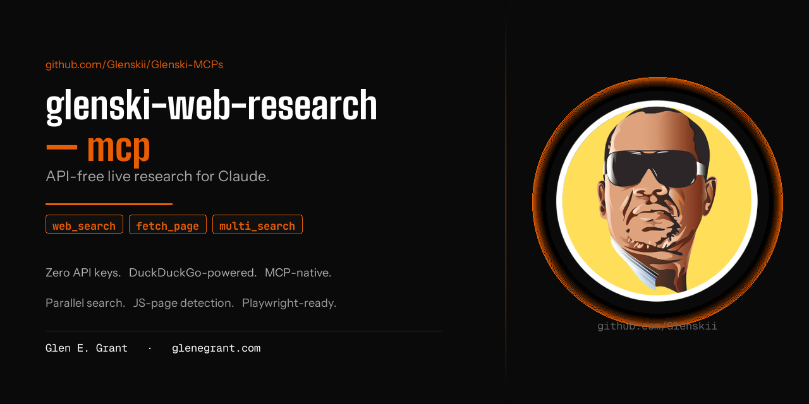

# Glenski-MCPs



**Production-grade MCP servers by Glen E. Grant.**

Self-contained, documented, zero-bloat tools that add live capability to Claude. Each server solves one problem well — no wrapper bloat, no paid APIs you don't need, no lock-in.

Wire into Claude Code or Claude Desktop. Start using it. Done.

By [Glen E. Grant](https://profile.glenegrant.com) · [glenegrant.com](https://glenegrant.com)

---

## Servers

| MCP | What it does | API key |
|-----|-------------|---------|
| [glenski-web-research-mcp](./glenski-web-research-mcp/) | Live web search, page fetch, and parallel multi-angle research. DuckDuckGo-powered. JS-page detection with Playwright fallback. | None |

---

## Install any server

Every server is a self-contained folder with its own `requirements.txt` and `README.md`. Install is the same for all:

```bash
git clone https://github.com/Glenskii/Glenski-MCPs
cd Glenski-MCPs/<server-name>
pip install -r requirements.txt
```

Then wire the server path into `~/.claude/mcp.json` (Claude Code) or `claude_desktop_config.json` (Claude Desktop). Each server's README has the exact config block and venv setup instructions.

---

## Philosophy

- **No paid APIs unless the capability genuinely requires one.** DuckDuckGo is free. Local processing is free. Only pay for what adds real value.
- **No wrapper bloat.** Each server does one thing well and integrates cleanly into the MCP tool ecosystem.
- **Transparent.** Read the source. Understand exactly what runs on your machine.
- **Standard format.** Every server works with Claude Code, Claude Desktop, Cursor, Windsurf, and any MCP-compatible host.

---

## Related

**[Glenski-Toolkit](https://github.com/Glenskii/Glenski-Toolkit)** — Skills and prompt guides for Claude Code. Quality enforcement tools, design standards, SEO, security audit, and more. MCP servers live here instead to keep each repo focused.

---

## Author

**Glen E. Grant**
[profile.glenegrant.com](https://profile.glenegrant.com) · [glen@glenegrant.com](mailto:glen@glenegrant.com) · [github.com/Glenskii](https://github.com/Glenskii)

---

## License

[CC BY 4.0](https://creativecommons.org/licenses/by/4.0/) — share freely, credit appreciated.

---

`#mcp` `#claude` `#ai-tools` `#web-research` `#no-api-key` `#duckduckgo` `#model-context-protocol`
