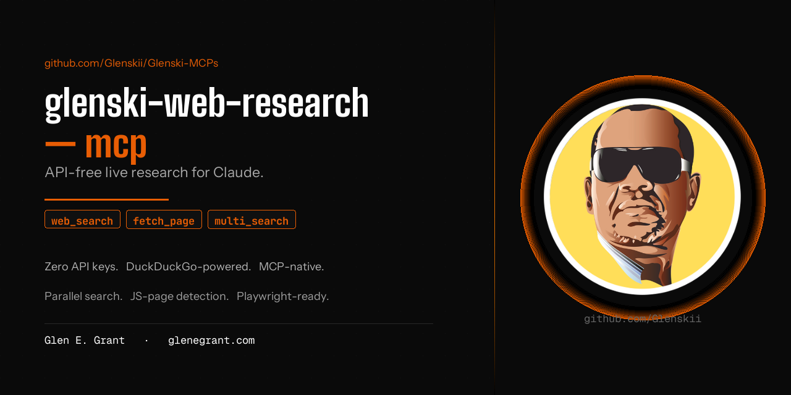

# Glenski MCPs



Practical MCP servers built by [Glen E. Grant](https://profile.glenegrant.com).

These are local-first tools for people who want useful AI capabilities without
wrapping every action in another paid service. Each server is self-contained,
documented, readable, and designed to work with any MCP-compatible host.

## Why this repo exists

I like tools that do one job clearly. I also like a degree of privacy for some
works: knowing what's running on my machine and where the data goes. And I like
not paying API tokens for something that doesn't need a model call to work.

That leads to a few simple rules:

- No API key when a solid free option can do the job
- No hidden model calls
- No vendor lock-in
- Secure defaults for network access and hostile page content
- Structured output that gives the connected AI host good evidence to work with
- Code that can be read, tested, and changed without unpacking a framework

## Available servers

| Server | What it does | API key |
|---|---|---|
| [Glenski Web Research MCP](./glenski-web-research-mcp/) | Searches, cross-references, fetches, ranks, and prepares citation-ready web evidence | None |

## Glenski Web Research MCP v3

Built to answer real questions with cited, cross-referenced evidence, not just
return a list of links.

The research server now has four tools:

- `deep_research` handles the full workflow from question to evidence package
- `web_search` runs a focused DuckDuckGo search
- `multi_search` searches several angles in parallel
- `fetch_page` safely extracts readable content from a public page

`deep_research` is the main event. It plans several queries, scores sources,
fetches the strongest pages, extracts relevant passages, assigns citation IDs,
flags topics that may contain conflicting claims, and gives the host model a
clean evidence package for the final answer.

It is designed to feel closer to a Perplexity-style research workflow while
remaining free, transparent, and local-first.

## Install

```powershell
git clone https://github.com/Glenskii/Glenski-MCPs.git
cd Glenski-MCPs\glenski-web-research-mcp
python -m venv .venv
.\.venv\Scripts\Activate.ps1
python -m pip install -e .
```

The server README includes ready-to-use configuration for Codex, Claude Code,
Claude Desktop, Cursor, and Windsurf.

## Author

**Glen E. Grant**

[profile.glenegrant.com](https://profile.glenegrant.com)

[github.com/Glenskii](https://github.com/Glenskii)

[glen@glenegrant.com](mailto:glen@glenegrant.com)

## License

[CC BY 4.0](https://creativecommons.org/licenses/by/4.0/). Share it, build on
it, and credit the work.
